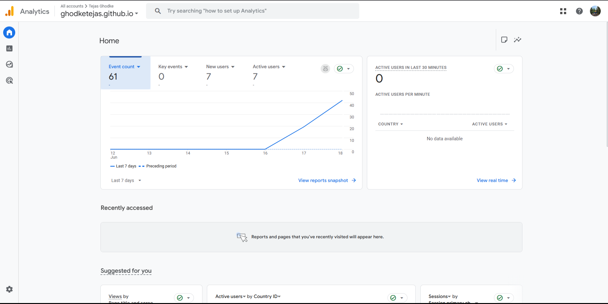
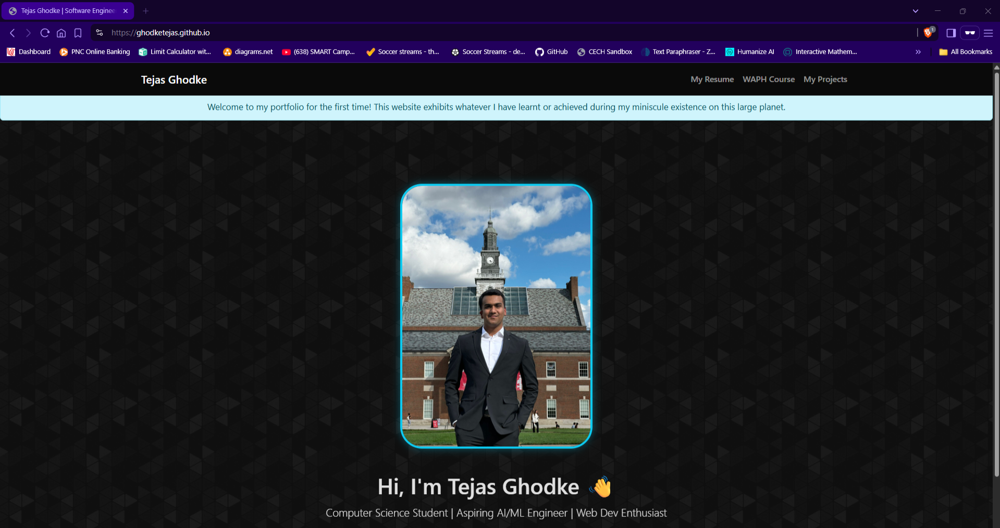
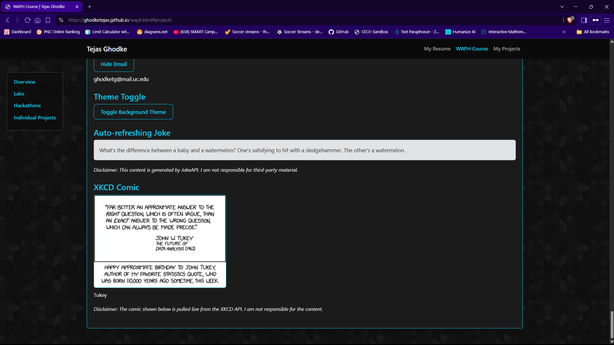

# Web Application Programming and Hacking
**Instructor:** Dr. Phu Phung

**Student:** Tejas Ghodke  
**Email:** ghodketg@mail.uc.edu


---

# Individual Project 1 – Front-end Web Development with a Professional Profile Website and API Integration on GitHub.io

## Project Overview

This project was created as part of the Web Application Programming and Hacking (WAPH) course to demonstrate front-end web development skills and deploy a professional profile website on GitHub Pages. The site includes my resume, background, technical skills, and various interactive components designed to showcase modern web development techniques.

The project adheres to specific general, non-technical, and technical requirements. Key outcomes include a live resume site, course project integration, interactive UI features with JavaScript and jQuery, and real-time public API integration.

**Live Website:** [https://ghodketg.github.io](https://ghodketg.github.io)  
**GitHub Repository:** [https://github.com/ghodketg/ghodketg.github.io](https://github.com/ghodketg/ghodketg.github.io)

---

## General Requirements:

### Personal Professional Website:
- Deployed on GitHub Pages at `ghodketg.github.io`
- Displays headshot, name, contact info, resume, education background, experiences, and skills
- Resume includes clearly separated sections and uses Bootstrap styling


### WAPH Course Page:
- Linked from the main page to a separate HTML file detailing the "Web Application Programming and Hacking" course
- Breaks down Labs, Hackathons, and Projects using structured accordions and collapsible sections


---

## Non-Technical Requirements:

- Used **Bootstrap 5** framework and customized styles with external `style.css`
- Designed UI to reflect professional aesthetic for potential employers
- Implemented live visit tracking and welcome logic using JavaScript cookies

### Page Visit Tracker
Cookie-based welcome message for first-time and returning visitors
Google Analytics is also integrated to track all page visits and user interactions.

```js
const lastVisit = getCookie("lastVisit");
if (!lastVisit) {
  showMessage("Welcome to my homepage for the first time!");
} else {
  showMessage(`Welcome back! Your last visit was ${lastVisit}`);
}
setCookie("lastVisit", new Date().toLocaleString(), 365);

// Google Analytics tracking is handled automatically via gtag integration in the <head> of each page.
// example:

<!-- Google tag (gtag.js) -->
  <script async src="https://www.googletagmanager.com/gtag/js?id=G-841Z8H1CBK"></script>
  <script>
    window.dataLayer = window.dataLayer || [];
    function gtag(){dataLayer.push(arguments);}
    gtag('js', new Date());

    gtag('config', 'G-841Z8H1CBK');
  </script>
```

Screenshot of my google analytics page:


---

## Technical Requirements:

### JavaScript

#### Digital Clock:
Displays a live updating digital clock in real-time using plain JavaScript.

```js
setInterval(() => {
  document.getElementById("digit-clock").textContent = new Date().toLocaleTimeString();
}, 1000);
```

#### Analog Clock:
Implemented with `<canvas>` and pure JavaScript to draw hands based on time.

#### Email Toggle:
Click button toggles visibility of my email address.

```js
toggleBtn.addEventListener("click", () => {
  emailDiv.style.display = emailDiv.style.display === "none" ? "block" : "none";
});
```

#### Background Theme Toggle:
Switches between base theme and alternate theme (`.alt-theme` class).

#### First time page visit:


---

Screenshot of all of the above:


### Public Web API Integrations:

#### JokeAPI
Fetches and displays a new joke every 60 seconds using `fetch()`.

```js
setInterval(() => {
  fetch("https://v2.jokeapi.dev/joke/Any?format=txt")
    .then(res => res.text())
    .then(data => jokeBox.textContent = data);
}, 60000);
```

#### XKCD API
Fetches and displays the latest XKCD comic with the title and image.

```js
fetch("https://xkcd.vercel.app/?comic=latest")
  .then(res => res.json())
  .then(data => {
    document.getElementById("xkcd-img").src = data.img;
    document.getElementById("xkcd-title").textContent = data.title;
  });
```

Screenshot of both APIs:


---